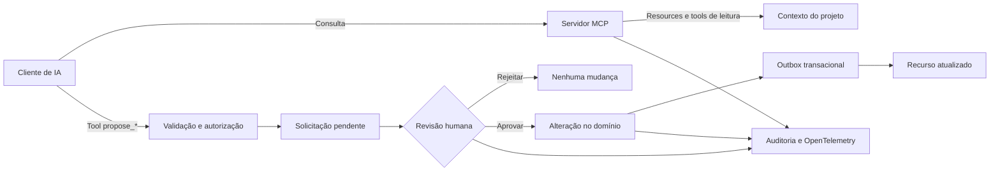

# Project Bridge

Uma ponte segura entre agentes de IA e um sistema de projetos: a IA pode consultar contexto e propor mudanças, mas uma pessoa continua responsável por decidir o que realmente será alterado.

[](https://github.com/adrianohsnegrao/project-bridge/actions/workflows/ci.yml)
[](https://nodejs.org/)
[](https://modelcontextprotocol.io/)
[](https://www.typescriptlang.org/)
[](LICENSE)

> **Em resumo:** o Project Bridge não é um Jira completo e não é um gerenciador de APIs. É um protótipo de integração e governança para agentes de IA, usando a gestão de projetos como caso de uso.


## Entenda o projeto em dois minutos

### O que ele é

O Project Bridge demonstra como permitir que um agente de IA participe de um fluxo de trabalho real sem receber acesso irrestrito ao sistema.

Por meio do [Model Context Protocol (MCP)](https://modelcontextprotocol.io/), um cliente de IA pode:

- consultar apenas o contexto necessário de um projeto;
- ler tarefas, bloqueios, riscos e decisões;
- propor a criação ou atualização de uma tarefa;
- propor a resolução de um bloqueio;
- acompanhar o resultado de uma solicitação.

As propostas não alteram os dados imediatamente. Elas entram em uma fila de revisão, na qual um usuário autorizado pode aprovar ou rejeitar a ação. O backend valida identidade, permissões, escopo, versão dos dados e idempotência antes de realizar qualquer mudança.

Isso separa claramente duas responsabilidades:

- **a IA sugere**, com base no contexto e nas ferramentas permitidas;
- **o sistema e a pessoa decidem**, aplicando regras de autorização e governança.

### O que ele não é

- **Não é um gerenciador de projetos completo.** A interface apresenta projetos, tarefas, riscos, decisões e bloqueios para demonstrar o domínio, mas não oferece toda a experiência de produtos como Jira, Linear ou Trello.
- **Não é um gerenciador de APIs.** A API e o servidor MCP são os meios de integração, não o produto final.
- **Não é um chatbot.** O foco está em contexto estruturado, ferramentas tipadas, autorização, aprovação e rastreabilidade.
- **Não contém um modelo generativo embutido.** Ele expõe uma infraestrutura que pode ser consumida por clientes compatíveis com MCP, como o Codex.
- **Não aprova ou rejeita projetos.** A aprovação decide se uma ação proposta — por exemplo, criar uma tarefa — deve ou não modificar o projeto.

No protótipo atual, tarefas, riscos, decisões e bloqueios aparecem como resumos dentro do projeto e não possuem páginas individuais clicáveis. Essa é uma limitação deliberada de escopo: o objetivo principal é demonstrar a integração segura com agentes de IA, e não reproduzir todas as funções de um sistema de gestão.

### Para quem este repositório é útil

- **Usuários e avaliadores:** para visualizar um fluxo em que uma sugestão automatizada sempre passa por controle humano.
- **Recrutadores:** para avaliar aplicação prática de MCP, human-in-the-loop, segurança, idempotência, concorrência, observabilidade e testes.
- **Desenvolvedores:** para estudar uma referência local e reproduzível de servidor MCP e aplicação web compartilhando o mesmo domínio.

## Exemplo prático

Imagine que um agente esteja analisando o projeto fictício **Atlas** e identifique que uma tarefa crítica precisa mudar de prioridade:

1. O agente consulta o contexto permitido do projeto pelo MCP.
2. Ele chama a ferramenta `propose_task_update`, informando a alteração e a justificativa.
3. O servidor valida o token, os escopos, os argumentos e a versão atual da tarefa.
4. A proposta aparece na Central de Aprovações como **pendente**.
5. Uma pessoa revisa a ação, os dados anteriores, a alteração proposta e a justificativa.
6. Ao aprovar, o backend atualiza a tarefa; ao rejeitar, nenhuma alteração é aplicada ao projeto.
7. A decisão e a execução ficam registradas na auditoria e nos traces.
8. Clientes MCP conectados podem receber a notificação de que o recurso foi atualizado.

| Decisão | Resultado |
|---|---|
| Aprovar `propose_task` | Uma nova tarefa é criada no projeto. |
| Aprovar `propose_task_update` | Estado, prioridade, prazo ou responsável da tarefa são atualizados. |
| Aprovar `propose_blocker_resolution` | A resolução é registrada e o bloqueio é marcado como resolvido. |
| Rejeitar qualquer proposta | A decisão é registrada, mas o domínio do projeto permanece inalterado. |
| Repetir a mesma requisição | A chave idempotente impede a criação ou execução duplicada. |

Depois da decisão, o cartão permanece na Central de Aprovações como histórico auditável. Os itens internos do projeto continuam exibidos como resumos porque não fazem parte de um módulo completo de gestão nesta versão.

## Problema que a arquitetura resolve

Dar acesso direto de um agente ao banco de dados ou a endpoints administrativos cria riscos difíceis de controlar:

- exposição de contexto além do necessário;
- escalada indevida de permissões;
- operações duplicadas após retries;
- sobrescrita de alterações concorrentes;
- falhas entre a gravação de uma mudança e a publicação de um evento;
- ausência de evidências sobre quem propôs, aprovou e executou uma ação.

O Project Bridge trata o agente como um participante limitado do sistema. Contexto e ferramentas são publicados por contrato; mutações são propostas; autorizações são verificadas no servidor; e toda ação relevante produz rastros verificáveis.

## Fluxo principal



As tools `propose_*` nunca executam a mudança de domínio diretamente. A mutação só ocorre após uma decisão humana válida e uma nova verificação das regras no backend.

## O que pode ser avaliado no portfólio

- servidor MCP com resources, tools, prompt, notificações e contratos tipados;
- transportes HTTP Streamable e `stdio`;
- validação de entrada e saída com Zod;
- autenticação Bearer e autorização por escopos MCP;
- senhas derivadas com `scrypt`, sessões revogáveis e RBAC;
- fluxo human-in-the-loop para todas as mutações propostas por IA;
- idempotência na criação e na decisão de solicitações;
- concorrência otimista com versão esperada;
- outbox transacional com nova tentativa após falha de publicação;
- notificações `resources/updated` após publicação;
- auditoria persistida de leituras, propostas e decisões;
- spans OpenTelemetry e exportação OTLP opcional;
- testes de contrato executados sem depender de um modelo pago;
- CI para testes, tipos, build e auditoria de dependências.

## Experiência disponível na interface

A aplicação web foi desenhada como um produto administrativo comum, sem aparência de chatbot:

- login com perfis de administrador, revisor e visualizador;
- tutorial no primeiro acesso;
- visão geral dos projetos e indicadores;
- criação e edição das informações principais de um projeto;
- projeto fictício Atlas com dados prontos para demonstração;
- resumos de tarefas, riscos, decisões e bloqueios;
- Central de Aprovações com comparação entre estado atual e alteração proposta;
- histórico de solicitações aprovadas e rejeitadas;
- página de integrações com instruções MCP;
- visualização de auditoria;
- visualizador de traces com duração, atributos, erros e correlação.

## Arquitetura

```text
project-bridge/
├── server/
│   ├── API HTTP e aplicação web
│   ├── autenticação, sessões e RBAC
│   ├── servidor MCP HTTP e stdio
│   ├── domínio compartilhado
│   ├── SQLite, migrations e outbox
│   ├── auditoria e OpenTelemetry
│   └── testes de contrato
├── web/
│   ├── Central de Projetos
│   ├── Central de Aprovações
│   ├── Integrações e auditoria
│   └── visualizador de traces
├── docs/
│   ├── imagens da demonstração
│   └── validação com o Codex
└── .codex/
    └── exemplo de configuração MCP
```

A API web e os dois transportes MCP usam o mesmo domínio e a mesma camada de persistência. O servidor MCP não acessa o arquivo SQLite diretamente, evitando regras duplicadas ou caminhos alternativos de autorização.

## Capacidades MCP

### Resources

| URI | Conteúdo |
|---|---|
| `project-bridge://projects` | Catálogo resumido dos projetos disponíveis. |
| `project-bridge://projects/{projectId}` | Contexto completo de um projeto: objetivo, tarefas, decisões, impedimentos e documentos. |

### Tools

| Tool | Comportamento |
|---|---|
| `list_projects` | Lista projetos com estado, responsável, progresso e data-alvo. |
| `get_project_context` | Retorna o contexto estruturado de um projeto. |
| `list_project_blockers` | Lista os impedimentos abertos de um projeto. |
| `propose_task` | Cria uma solicitação pendente para uma nova tarefa. |
| `propose_task_update` | Cria uma solicitação pendente para atualizar uma tarefa existente. |
| `propose_blocker_resolution` | Cria uma solicitação pendente para resolver um bloqueio. |
| `get_approval_status` | Consulta o estado e o resultado de uma solicitação. |

### Prompt

`project-status-review` entrega uma sequência reutilizável para revisar o contexto estruturado com foco executivo, em riscos ou em entrega. O prompt orienta o cliente a separar fatos, riscos e recomendações e a nunca afirmar que uma proposta já foi executada.

### Notificações

Após a publicação de um evento da outbox, clientes MCP inscritos recebem `notifications/resources/updated`. Assim, uma alteração aprovada pode invalidar o contexto anteriormente lido pelo agente.

## Persistência e concorrência

- SQLite com migrations versionadas e aplicação automática;
- transações para dados de domínio, auditoria e eventos da outbox;
- `expectedVersion` nas propostas de atualização;
- conflito explícito quando a tarefa mudou depois da proposta;
- `Idempotency-Key` na criação de solicitações;
- decisão idempotente no backend;
- worker periódico para publicar eventos pendentes;
- evento marcado como processado somente depois da publicação;
- eventos preservados após falha para nova tentativa no ciclo seguinte.

O desenho é apropriado para execução local e instância única. SQLite não é apresentado como substituto de uma infraestrutura distribuída de produção.

## Segurança demonstrada

- autenticação Bearer no MCP HTTP;
- comparação de tokens MCP por hash e em tempo constante;
- escopos específicos para leitura, consulta de aprovações e cada tipo de proposta, como `projects:read`, `approvals:read` e `tasks:propose`;
- autorização por escopo específico para cada categoria de tool;
- sessões web revogáveis;
- RBAC no backend para leitura, revisão e administração;
- validação estrita de schemas;
- bloqueio de mutações sem aprovação humana;
- auditoria de leituras, propostas e decisões;
- traces limitados a metadados operacionais, sem registrar tokens ou senhas.

## Observabilidade

Cada operação instrumentada recebe `traceId` e `spanId`. Os spans são persistidos localmente para a tela de inspeção e também podem ser enviados a um coletor compatível com OTLP.

Exemplos de operações instrumentadas:

- requisições HTTP, incluindo chamadas ao endpoint MCP;
- criação e atualização de projetos;
- decisão humana;
- tentativa de publicação da outbox.

Para habilitar exportação externa:

```powershell
$env:OTEL_EXPORTER_OTLP_ENDPOINT = "http://localhost:4318"
$env:OTEL_SERVICE_NAME = "project-bridge"
pnpm dev
```

Sem `OTEL_EXPORTER_OTLP_ENDPOINT`, o projeto continua funcionando apenas com persistência local. Consulte a [documentação oficial do OpenTelemetry](https://opentelemetry.io/docs/).

## Como executar

### Requisitos

- Node.js 22 ou superior;
- pnpm 11 ou superior.

### Instalação

```powershell
pnpm install
pnpm dev
```

Endereços locais:

- interface: [http://127.0.0.1:5174](http://127.0.0.1:5174);
- API e MCP: [http://127.0.0.1:8010](http://127.0.0.1:8010);
- endpoint MCP: [http://127.0.0.1:8010/mcp](http://127.0.0.1:8010/mcp).

O frontend é servido pelo Vite em desenvolvimento. Alterações no backend exigem reiniciar `pnpm dev`.

### Contas de demonstração

| Perfil | E-mail | Senha | Permissões |
|---|---|---|---|
| Administrador | `admin@projectbridge.local` | `admin12345` | Configuração, revisão e auditoria. |
| Revisor | `revisor@projectbridge.local` | `revisor12345` | Consulta e decisão de solicitações. |
| Visualizador | `leitor@projectbridge.local` | `leitor12345` | Somente leitura. |

Essas credenciais são exclusivamente locais e não devem ser reutilizadas em produção.

### Roteiro rápido de demonstração

1. Entre como administrador.
2. Conclua ou pule o tutorial inicial.
3. Abra o projeto Atlas e observe tarefas, riscos, decisões e bloqueios de exemplo.
4. Acesse **Integrações** para visualizar endpoint, transportes, resources, tools e escopos MCP.
5. Abra **Aprovações** e revise a solicitação de exemplo já incluída nos dados fictícios.
6. Aprove ou rejeite e confirme o resultado no histórico e no projeto.
7. Use **Auditoria** e **Traces** para acompanhar a trajetória completa da operação.

## Conectar um cliente MCP

### Transporte stdio

```json
{
  "mcpServers": {
    "project-bridge": {
      "command": "pnpm",
      "args": ["--filter", "@project-bridge/server", "mcp:stdio"],
      "cwd": "CAMINHO_ABSOLUTO_DO_REPOSITORIO"
    }
  }
}
```

### Transporte HTTP

Configure `PROJECT_BRIDGE_HTTP_CREDENTIALS` no processo do servidor, conforme o modelo de [`.env.example`](.env.example), e envie o token correspondente:

```http
Authorization: Bearer pbmcp_...
```

O endpoint público `/mcp` exige Bearer token. Tokens ausentes ou inválidos retornam `401`; chamadas a tools sem o escopo necessário retornam erro estruturado de autorização.

Há um exemplo em [`.codex/config.toml`](.codex/config.toml) e um roteiro detalhado em [`docs/VALIDACAO_CODEX.md`](docs/VALIDACAO_CODEX.md).

## Scripts e qualidade

```powershell
pnpm dev                                           # inicia API, MCP HTTP e frontend
pnpm --filter @project-bridge/server mcp:stdio     # inicia o servidor MCP por stdio
pnpm test                                          # executa os testes
pnpm typecheck                                     # valida os tipos
pnpm build                                         # gera os artefatos de produção
pnpm audit:deps                                    # audita dependências
```

A suíte cobre 18 cenários, incluindo:

- autenticação e sessões;
- RBAC da aplicação web e escopos das tools MCP;
- escopos MCP;
- schemas e contratos das tools;
- aprovação e rejeição;
- idempotência;
- conflito de versão;
- outbox, nova tentativa após falha e notificações;
- propagação de contexto OpenTelemetry;
- exportação OTLP.

O workflow de CI executa testes, verificação de tipos, build e auditoria de dependências.

## Estado atual e limitações

Este repositório é um protótipo de portfólio executável, não um SaaS pronto para produção.

- os dados são fictícios e voltados à demonstração;
- a execução é local e de instância única;
- a persistência usa SQLite;
- as contas são pré-configuradas, sem cadastro público;
- não há HTTPS, provedor de identidade externo ou recuperação de senha;
- não há integração real com Jira, Linear, Trello ou outros gestores;
- não há modelo generativo incorporado nem chave de IA obrigatória;
- tarefas, riscos, decisões e bloqueios não têm páginas individuais;
- não há comentários, anexos, busca avançada, filtros complexos ou colaboração em tempo real;
- a exportação OTLP fica desabilitada até que um endpoint seja configurado.

O objetivo desta versão é tornar verificável a camada que costuma faltar em demos de agentes: contratos claros, contexto mínimo, autorização, aprovação humana, consistência, auditoria, observabilidade e testes.

## English summary

**Project Bridge is a governed integration layer between AI agents and a project-domain application.** It is not a full project manager, an API management product, or a chatbot.

Through MCP, an authenticated agent can read scoped project context and submit typed proposals for task creation, task updates, or blocker resolution. Every proposed mutation is held for human review. Approval triggers server-side authorization, optimistic concurrency checks, an idempotent domain change, transactional outbox publication, audit records, and trace data; rejection leaves the project unchanged.

The repository demonstrates MCP resources, tools, prompts and notifications, Streamable HTTP and stdio transports, TypeScript and Zod contracts, Bearer scopes, project-level authorization, human-in-the-loop workflows, SQLite migrations, optimistic concurrency, durable outbox processing, OpenTelemetry instrumentation, contract tests, and CI.

## Referências oficiais

- [Model Context Protocol](https://modelcontextprotocol.io/)
- [MCP TypeScript SDK](https://github.com/modelcontextprotocol/typescript-sdk)
- [OpenTelemetry](https://opentelemetry.io/docs/)
- [Codex MCP](https://developers.openai.com/codex/mcp/)

## Licença

Distribuído sob a licença [MIT](LICENSE).
