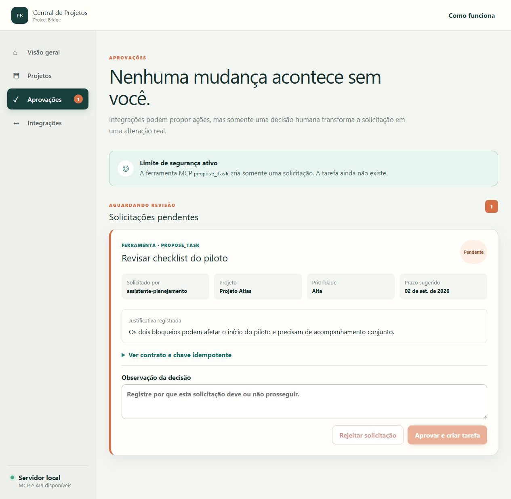
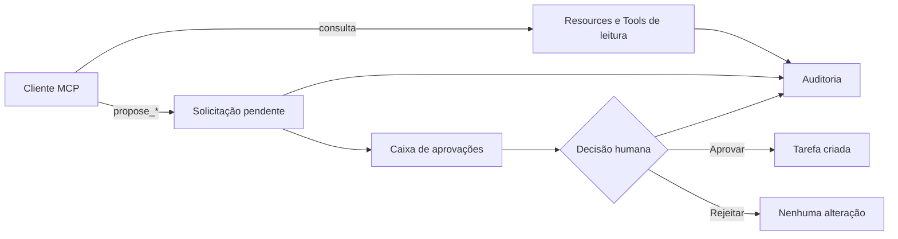

# Project Bridge

Central local de projetos com integração MCP, contratos tipados, aprovação humana e auditoria de operações.

[](https://github.com/adrianohsnegrao/project-bridge/actions/workflows/ci.yml)
[](https://nodejs.org/)
[](https://modelcontextprotocol.io/)
[](LICENSE)

O Project Bridge demonstra como disponibilizar contexto e ações para clientes de IA sem entregar acesso irrestrito aos dados e sem transformar a experiência do usuário em um chatbot.

> Estado atual: protótipo funcional em evolução, preparado para execução e avaliação local.



## Por que este projeto existe

Muitos exemplos de integração com IA entregam ferramentas poderosas ao modelo, mas não deixam claro quem pode executar cada ação, como evitar duplicidade ou como uma pessoa mantém o controle. Este projeto explora exatamente essa fronteira: um servidor MCP fornece contexto estruturado e permite propor uma mudança, enquanto autorização, validação, aprovação e auditoria permanecem responsabilidades explícitas da aplicação.

O foco técnico está no protocolo e no desenho seguro da integração. Nenhum modelo generativo é necessário para executar a demonstração ou a suíte de testes.

## O que já funciona

- interface em português com visão geral, projetos, aprovações e auditoria;
- criação e edição de projetos pela interface, com formulário acessível e responsivo;
- tutorial no primeiro acesso;
- Projeto Atlas com decisões, tarefas, impedimentos e documentos fictícios;
- banco SQLite local com seed idempotente, WAL, timeout de concorrência e migrações versionadas;
- concorrência otimista por versão, impedindo que uma edição obsoleta sobrescreva outra;
- outbox transacional com reprocessamento de notificações MCP após indisponibilidade;
- tracing com OpenTelemetry JS para requisições HTTP e operações internas;
- exportação local de spans para inspeção sem infraestrutura adicional e OTLP/HTTP opcional;
- servidor MCP construído com o SDK oficial TypeScript 2.0;
- Streamable HTTP em `/mcp` e execução local por stdio;
- autenticação Bearer obrigatória no transporte HTTP, com tokens fora do repositório;
- identidade e escopos vinculados à credencial no servidor;
- login web com senha derivada por `scrypt` e sessão revogável em cookie `HttpOnly`;
- RBAC aplicado no backend para administrador, gerente, revisor e leitor;
- MCP Resources, Tools e Prompt;
- schemas Zod de entrada e saída;
- escopos mínimos por ferramenta;
- três Tools mutáveis que criam apenas solicitações pendentes;
- aprovação ou rejeição humana pela interface;
- chave idempotente para impedir solicitações duplicadas;
- trilha de auditoria com cliente, ação, estado e duração;
- auditoria separando ações humanas de chamadas feitas por integrações;
- notificação de mudança para clientes MCP inscritos quando projetos ou aprovações alteram Resources;
- dezoito testes automatizados, incluindo sessões web, RBAC, concorrência, outbox, OpenTelemetry, autenticação MCP, mutações, CRUD humano, transporte HTTP e assinatura real.

## Corte vertical demonstrado



Uma chamada para qualquer Tool `propose_*` nunca altera o projeto diretamente. Ela registra intenção, argumentos, justificativa, cliente, escopo e chave idempotente. A alteração só é executada após aprovação humana.

## Arquitetura

```text
apps/
├── server/
│   ├── API Express
│   ├── MCP Streamable HTTP
│   ├── MCP stdio
│   ├── domínio e permissões
│   ├── SQLite
│   └── contract tests
└── web/
    ├── React + TypeScript
    ├── tutorial
    ├── central de projetos
    ├── aprovações
    └── auditoria
```

O SDK MCP 2.0 utiliza uma factory por requisição no transporte HTTP. A API comum e as instâncias MCP compartilham a mesma camada de domínio e o mesmo banco, mas clientes MCP não recebem acesso direto ao SQLite.

### Persistência e concorrência

O protótipo continua usando SQLite porque isso mantém o quickstart simples e reproduzível. A camada de persistência, porém, agora explicita mecanismos necessários quando mais de uma pessoa ou processo pode disputar o mesmo dado:

- `schema_migrations` registra a evolução do schema sem depender de recriar o banco;
- WAL, `busy_timeout` e índices reduzem contenção e tornam as consultas operacionais previsíveis;
- cada projeto possui uma `version`; edições enviam `expected_version` e recebem `409 PROJECT_VERSION_CONFLICT` se o dado mudou desde a leitura;
- a notificação de Resource é gravada na `outbox_events` dentro da mesma transação da alteração;
- eventos não publicados permanecem pendentes e são reprocessados na inicialização e durante a execução;
- a entrega da outbox é pelo menos uma vez; a notificação é idempotente porque orienta o cliente a reler o Resource atual.

Isso prepara a fronteira do domínio para concorrência e para uma futura troca do adapter por PostgreSQL, mas não apresenta o SQLite como banco distribuído. Em uma implantação horizontal, o worker da outbox e o mecanismo de claim de eventos também devem ser coordenados pelo banco ou por uma fila.

### Observabilidade com OpenTelemetry

O serviço utiliza o SDK oficial OpenTelemetry para produzir spans reais, não apenas linhas de log com aparência de trace. A instrumentação cobre:

- cada requisição HTTP, com método, caminho, status e duração;
- operações internas de criação e edição de projeto;
- decisão de aprovação;
- publicação da outbox;
- relação pai-filho entre a requisição e a operação de domínio;
- cabeçalho W3C `traceparent` nas respostas para correlação.

Um exporter local persiste até 500 spans na tabela `telemetry_spans`, permitindo que a interface mostre traces, IDs, atributos, erros e duração sem exigir conta ou serviço externo. O endpoint protegido `GET /api/observability` fornece o mesmo diagnóstico em JSON.

Para enviar os traces também a um Collector ou backend compatível com OTLP/HTTP, defina uma das variáveis antes de iniciar o servidor:

```powershell
$env:OTEL_EXPORTER_OTLP_ENDPOINT='http://127.0.0.1:4318'
# ou o endpoint completo de traces:
$env:OTEL_EXPORTER_OTLP_TRACES_ENDPOINT='http://127.0.0.1:4318/v1/traces'
pnpm dev
```

O exporter local continua ativo quando OTLP é habilitado. A instrumentação evita corpo de requisição, cookies, senhas e tokens; somente atributos operacionais explicitamente permitidos são gravados. Em produção, retenção, amostragem e controles do backend devem ser definidos conforme volume e política de dados. A documentação oficial recomenda o Collector para exportação em produção: [OpenTelemetry JavaScript — Exporters](https://opentelemetry.io/docs/languages/js/exporters/).

## Capacidades MCP

### Resources

| URI | Conteúdo |
|---|---|
| `project-bridge://projects` | Catálogo resumido dos projetos |
| `project-bridge://projects/{projectId}` | Contexto completo de um projeto |

### Tools

| Tool | Escopo | Comportamento |
|---|---|---|
| `list_projects` | `projects:read` | Somente leitura |
| `get_project_context` | `projects:read` | Somente leitura |
| `list_project_blockers` | `projects:read` | Somente leitura |
| `get_approval_status` | `approvals:read` | Somente leitura |
| `propose_task` | `tasks:propose` | Cria solicitação; exige decisão humana |
| `propose_task_update` | `tasks:update:propose` | Propõe estado, prioridade, prazo ou responsável |
| `propose_blocker_resolution` | `blockers:resolve:propose` | Propõe resolução documentada de impedimento |

Todas as Tools retornam conteúdo textual e `structuredContent`. As anotações MCP informam leitura, idempotência, efeito destrutivo e acesso ao mundo externo.

### Prompt

`project-status-review` orienta um cliente a consultar primeiro o Resource do projeto, diferenciar fatos, riscos e recomendações e usar somente Tools de proposta quando desejar sugerir uma ação.

### Notificações

Clientes que abrirem uma assinatura para `project-bridge://projects/{projectId}` recebem `notifications/resources/updated` quando uma aprovação humana altera o trabalho ou quando uma pessoa edita o projeto pela interface. Criações e edições também invalidam o catálogo `project-bridge://projects`. O cliente pode então reler o Resource em vez de trabalhar com contexto desatualizado.

O fluxo usa `subscriptions/listen` e o barramento de eventos do SDK MCP 2.0. Repetir uma decisão já processada não publica outro evento.

## Como executar

### Requisitos

- Node.js 22 ou superior
- pnpm

Na raiz do projeto:

```bash
pnpm install
pnpm dev
```

Acesse:

- interface: [http://127.0.0.1:5174](http://127.0.0.1:5174)
- API: [http://127.0.0.1:8010/api/health](http://127.0.0.1:8010/api/health)
- MCP: `http://127.0.0.1:8010/mcp`

### Contas fictícias locais

| Perfil | E-mail | Senha | Capacidades |
|---|---|---|---|
| Administrador | `admin@projectbridge.local` | `admin12345` | Todas |
| Revisor | `revisor@projectbridge.local` | `revisor12345` | Leitura e decisões de aprovação |
| Leitor | `leitor@projectbridge.local` | `leitor12345` | Somente leitura |

Essas credenciais existem apenas para tornar o protótipo reproduzível e usam dados fictícios. Uma implantação real deve provisionar usuários externamente, exigir troca inicial e aplicar política de senha.

## Conectar um cliente MCP

### stdio

O cliente deve iniciar o script no diretório do servidor. Exemplo genérico:

```json
{
  "mcpServers": {
    "project-bridge": {
      "command": "pnpm",
      "args": ["--dir", "CAMINHO/ABSOLUTO/project-bridge/apps/server", "mcp:stdio"],
      "env": {
        "PROJECT_BRIDGE_CLIENT_NAME": "meu-cliente-local",
        "PROJECT_BRIDGE_SCOPES": "projects:read,approvals:read,tasks:propose,tasks:update:propose,blockers:resolve:propose"
      }
    }
  }
}
```

### Streamable HTTP

Endpoint:

```text
http://127.0.0.1:8010/mcp
```

O endpoint falha de forma segura quando nenhuma credencial foi configurada. Defina no ambiente do servidor um JSON com cliente, token e escopos autorizados:

```powershell
$env:PROJECT_BRIDGE_HTTP_CREDENTIALS='[{"client_name":"codex-local","token":"SEU-TOKEN-ALEATORIO-DE-32-CARACTERES","scopes":["projects:read","approvals:read","tasks:propose","tasks:update:propose","blockers:resolve:propose"]}]'
```

O cliente envia somente `Authorization: Bearer <token>`. Nome e escopos são recuperados da credencial correspondente no servidor; cabeçalhos enviados pelo cliente não ampliam permissões. Para o arquivo `.codex/config.toml`, disponibilize o mesmo token na variável `PROJECT_BRIDGE_HTTP_TOKEN`. A [documentação oficial de MCP no Codex](https://developers.openai.com/codex/mcp/) confirma o suporte a `bearer_token_env_var` para servidores Streamable HTTP.

### Validação com Codex

O repositório contém uma configuração por projeto em [`.codex/config.toml`](.codex/config.toml). Após iniciar o servidor, abra o diretório como projeto confiável no Codex e reinicie o cliente para carregar a integração.

A conexão também foi validada de forma independente com `codex-cli 0.150.0-alpha.8`: o cliente descobriu o servidor por Streamable HTTP, chamou `list_projects` e `get_project_context`, consumiu `structuredContent` e produziu um resumo sem acessar o banco ou usar o shell. A execução e a evidência de auditoria estão documentadas em [`docs/VALIDACAO_CODEX.md`](docs/VALIDACAO_CODEX.md).

A configuração segue a [documentação oficial de MCP no Codex](https://developers.openai.com/codex/mcp/), incluindo allowlist das Tools e aprovação do cliente para operações de escrita.

## Scripts

```bash
pnpm dev        # API, MCP e interface
pnpm test       # testes de domínio, API e contratos MCP
pnpm typecheck  # TypeScript em todos os pacotes
pnpm build      # builds de produção
pnpm audit:deps # auditoria das dependências de produção e desenvolvimento
```

O Vite recarrega mudanças do frontend automaticamente. Após alterar o backend, reinicie `pnpm dev`; o script evita watchers recursivos que podem se comportar de forma instável no Windows.

## Segurança demonstrada

- bind somente em `127.0.0.1`;
- proteção de Host e Origin fornecida pelo adapter Express oficial;
- Bearer token obrigatório no MCP HTTP;
- comparação de tokens por SHA-256 em tempo constante;
- credenciais fora do repositório e falha segura quando não configuradas;
- identidade e escopos definidos no servidor, não em cabeçalhos controlados pelo cliente;
- senhas derivadas com `scrypt`, salt individual e comparação em tempo constante;
- sessões aleatórias armazenadas somente por hash, com expiração de oito horas e logout revogável;
- cookie de sessão `HttpOnly`, `SameSite=Strict` e `Secure` em produção;
- autorização RBAC conferida pelo backend em cada mutação e acesso à auditoria;
- controle de versão otimista para bloquear lost updates;
- outbox transacional para não perder a invalidação de contexto após uma alteração confirmada;
- escopos separados por família de mutação;
- schemas estritos com Zod;
- mutação sujeita a aprovação humana;
- idempotência na fronteira da operação;
- auditoria de leituras, propostas e decisões;
- spans OpenTelemetry sem captura de cookies, tokens, senhas ou corpo das requisições;
- ausência de chaves ou modelo generativo no fluxo.
- auditoria de dependências de produção executada pela CI.

## Testes atuais

1. seed e indicadores do Projeto Atlas;
2. tarefa criada somente após aprovação;
3. repetição da decisão sem duplicar tarefa;
4. descoberta de Resources, Tools e Prompt;
5. saída estruturada e chave idempotente;
6. bloqueio de Tool sem escopo;
7. conexão e chamada reais por Streamable HTTP;
8. publicação idempotente e entrega real de atualização por assinatura MCP;
9. atualização de tarefa e resolução de impedimento somente após aprovação.
10. criação e edição de projetos com validação e auditoria da interface humana;
11. invalidação dos Resources de catálogo e detalhe após alterações de projeto.
12. rejeição de requests sem token ou com token inválido, inclusive com escopos forjados.
13. sessão obrigatória, cookie protegido e revogação por logout;
14. leitor autorizado a consultar, mas impedido de editar e auditar;
15. revisor autorizado a decidir aprovações sem editar projetos, com identidade auditada.
16. conflito de versão rejeitado sem sobrescrever a edição mais recente;
17. evento durável mantido na outbox durante falha e republicado na tentativa seguinte.
18. span OpenTelemetry persistido, `traceparent` válido e diagnóstico local acessível.

Os itens acima são cobertos por dezoito casos automatizados; alguns casos validam mais de um contrato dentro do mesmo fluxo.

## Limitações do protótipo

Estas limitações delimitam o primeiro corte e orientam as próximas evoluções. Elas são mantidas aqui para tornar decisões e trade-offs visíveis.

- [x] autenticação e autorização HTTP reais no lugar dos cabeçalhos demonstrativos;
- [x] mais operações mutáveis protegidas pelo mesmo fluxo de aprovação;
- [x] criação e edição de projetos pela interface;
- [x] notificações MCP quando Resources forem alterados;
- [x] validação documentada com cliente MCP externo (Codex CLI);
- [x] persistência preparada para concorrência multiusuário e futura distribuição, com os limites do SQLite documentados;
- [x] identidade de usuários e separação de suas permissões.
- [x] observabilidade com OpenTelemetry, traces locais e exportação OTLP opcional.

Os dados permanecem intencionalmente fictícios para que a demonstração possa ser executada e publicada sem expor informações reais.

## English summary

Project Bridge is a local project operations hub backed by a real MCP server. It exposes typed Resources, Tools and a Prompt while enforcing least-privilege scopes, idempotency, human approval for mutations and a complete audit trail. The repository includes optimistic concurrency, a transactional outbox, OpenTelemetry traces with optional OTLP export, a Portuguese user interface, Streamable HTTP and stdio transports, seeded fictional data and deterministic contract tests that run without an LLM or API key.

See the sections above for architecture, setup instructions, protocol capabilities, security decisions, tests and known limitations.

## Referências oficiais

- [Model Context Protocol](https://modelcontextprotocol.io/)
- [SDK TypeScript oficial](https://github.com/modelcontextprotocol/typescript-sdk)
- [Guia oficial de servidores MCP](https://github.com/modelcontextprotocol/typescript-sdk/blob/main/docs/server.md)
- [OpenTelemetry JavaScript](https://opentelemetry.io/docs/languages/js/)
- [Exporters OpenTelemetry](https://opentelemetry.io/docs/languages/js/exporters/)
