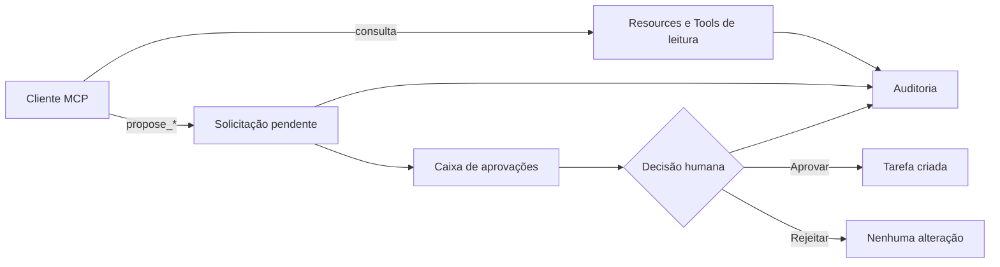

# Project Bridge

Central local de projetos com integração MCP, contratos tipados, aprovação humana e auditoria de operações.

[](https://github.com/adrianohsnegrao/project-bridge/actions/workflows/ci.yml)
[](https://nodejs.org/)
[](https://modelcontextprotocol.io/)
[](LICENSE)

O Project Bridge demonstra como disponibilizar contexto e ações para clientes de IA sem entregar acesso irrestrito aos dados e sem transformar a experiência do usuário em um chatbot.

> Estado atual: protótipo funcional em evolução, preparado para execução e avaliação local.


## Por que este projeto existe

Muitos exemplos de integração com IA entregam ferramentas poderosas ao modelo, mas não deixam claro quem pode executar cada ação, como evitar duplicidade ou como uma pessoa mantém o controle. Este projeto explora exatamente essa fronteira: um servidor MCP fornece contexto estruturado e permite propor uma mudança, enquanto autorização, validação, aprovação e auditoria permanecem responsabilidades explícitas da aplicação.

O foco técnico está no protocolo e no desenho seguro da integração. Nenhum modelo generativo é necessário para executar a demonstração ou a suíte de testes.

## O que já funciona

- interface em português com visão geral, projetos, aprovações e auditoria;
- tutorial no primeiro acesso;
- Projeto Atlas com decisões, tarefas, impedimentos e documentos fictícios;
- banco SQLite local com seed idempotente;
- servidor MCP construído com o SDK oficial TypeScript 2.0;
- Streamable HTTP em `/mcp` e execução local por stdio;
- MCP Resources, Tools e Prompt;
- schemas Zod de entrada e saída;
- escopos mínimos por ferramenta;
- três Tools mutáveis que criam apenas solicitações pendentes;
- aprovação ou rejeição humana pela interface;
- chave idempotente para impedir solicitações duplicadas;
- trilha de auditoria com cliente, ação, estado e duração;
- notificação de mudança para clientes MCP inscritos quando uma aprovação altera um projeto;
- nove testes automatizados, incluindo contratos das mutações, transporte HTTP e assinatura real.

## Corte vertical demonstrado



Uma chamada para qualquer Tool `propose_*` nunca altera o projeto diretamente. Ela registra intenção, argumentos, justificativa, cliente, escopo e chave idempotente. A alteração só é executada após aprovação humana.

## Arquitetura

```text
apps/
├── server/
│   ├── API Express
│   ├── MCP Streamable HTTP
│   ├── MCP stdio
│   ├── domínio e permissões
│   ├── SQLite
│   └── contract tests
└── web/
    ├── React + TypeScript
    ├── tutorial
    ├── central de projetos
    ├── aprovações
    └── auditoria
```

O SDK MCP 2.0 utiliza uma factory por requisição no transporte HTTP. A API comum e as instâncias MCP compartilham a mesma camada de domínio e o mesmo banco, mas clientes MCP não recebem acesso direto ao SQLite.

## Capacidades MCP

### Resources

| URI | Conteúdo |
|---|---|
| `project-bridge://projects` | Catálogo resumido dos projetos |
| `project-bridge://projects/{projectId}` | Contexto completo de um projeto |

### Tools

| Tool | Escopo | Comportamento |
|---|---|---|
| `list_projects` | `projects:read` | Somente leitura |
| `get_project_context` | `projects:read` | Somente leitura |
| `list_project_blockers` | `projects:read` | Somente leitura |
| `get_approval_status` | `approvals:read` | Somente leitura |
| `propose_task` | `tasks:propose` | Cria solicitação; exige decisão humana |
| `propose_task_update` | `tasks:update:propose` | Propõe estado, prioridade, prazo ou responsável |
| `propose_blocker_resolution` | `blockers:resolve:propose` | Propõe resolução documentada de impedimento |

Todas as Tools retornam conteúdo textual e `structuredContent`. As anotações MCP informam leitura, idempotência, efeito destrutivo e acesso ao mundo externo.

### Prompt

`project-status-review` orienta um cliente a consultar primeiro o Resource do projeto, diferenciar fatos, riscos e recomendações e usar somente Tools de proposta quando desejar sugerir uma ação.

### Notificações

Clientes que abrirem uma assinatura para `project-bridge://projects/{projectId}` recebem `notifications/resources/updated` quando uma aprovação humana cria uma tarefa naquele projeto. O cliente pode então reler o Resource em vez de trabalhar com contexto desatualizado.

O fluxo usa `subscriptions/listen` e o barramento de eventos do SDK MCP 2.0. Repetir uma decisão já processada não publica outro evento.

## Como executar

### Requisitos

- Node.js 22 ou superior
- pnpm

Na raiz do projeto:

```bash
pnpm install
pnpm dev
```

Acesse:

- interface: [http://127.0.0.1:5174](http://127.0.0.1:5174)
- API: [http://127.0.0.1:8010/api/health](http://127.0.0.1:8010/api/health)
- MCP: `http://127.0.0.1:8010/mcp`

## Conectar um cliente MCP

### stdio

O cliente deve iniciar o script no diretório do servidor. Exemplo genérico:

```json
{
  "mcpServers": {
    "project-bridge": {
      "command": "pnpm",
      "args": ["--dir", "CAMINHO/ABSOLUTO/project-bridge/apps/server", "mcp:stdio"],
      "env": {
        "PROJECT_BRIDGE_CLIENT_NAME": "meu-cliente-local",
        "PROJECT_BRIDGE_SCOPES": "projects:read,approvals:read,tasks:propose,tasks:update:propose,blockers:resolve:propose"
      }
    }
  }
}
```

### Streamable HTTP

Endpoint:

```text
http://127.0.0.1:8010/mcp
```

Sem configuração adicional, o cliente recebe somente `projects:read` e `approvals:read`. Para demonstrar a proposta de tarefa no ambiente local, envie:

```text
X-Project-Bridge-Client: meu-cliente-local
X-Project-Bridge-Scopes: projects:read,approvals:read,tasks:propose,tasks:update:propose,blockers:resolve:propose
```

Esses cabeçalhos são uma política local demonstrativa, não substituem OAuth ou autenticação em uma implantação remota.

### Validação com Codex

O repositório contém uma configuração por projeto em [`.codex/config.toml`](.codex/config.toml). Após iniciar o servidor, abra o diretório como projeto confiável no Codex e reinicie o cliente para carregar a integração.

A conexão também foi validada de forma independente com `codex-cli 0.150.0-alpha.8`: o cliente descobriu o servidor por Streamable HTTP, chamou `list_projects` e `get_project_context`, consumiu `structuredContent` e produziu um resumo sem acessar o banco ou usar o shell. A execução e a evidência de auditoria estão documentadas em [`docs/VALIDACAO_CODEX.md`](docs/VALIDACAO_CODEX.md).

A configuração segue a [documentação oficial de MCP no Codex](https://developers.openai.com/codex/mcp/), incluindo allowlist das Tools e aprovação do cliente para operações de escrita.

## Scripts

```bash
pnpm dev        # API, MCP e interface
pnpm test       # testes de domínio, API e contratos MCP
pnpm typecheck  # TypeScript em todos os pacotes
pnpm build      # builds de produção
```

## Segurança demonstrada

- bind somente em `127.0.0.1`;
- proteção de Host e Origin fornecida pelo adapter Express oficial;
- acesso de leitura por padrão;
- escopos separados por família de mutação;
- schemas estritos com Zod;
- mutação sujeita a aprovação humana;
- idempotência na fronteira da operação;
- auditoria de leituras, propostas e decisões;
- ausência de chaves ou modelo generativo no fluxo.

## Testes atuais

1. seed e indicadores do Projeto Atlas;
2. tarefa criada somente após aprovação;
3. repetição da decisão sem duplicar tarefa;
4. descoberta de Resources, Tools e Prompt;
5. saída estruturada e chave idempotente;
6. bloqueio de Tool sem escopo;
7. conexão e chamada reais por Streamable HTTP;
8. publicação idempotente e entrega real de atualização por assinatura MCP;
9. atualização de tarefa e resolução de impedimento somente após aprovação.

Os itens acima são cobertos por nove casos automatizados; alguns casos validam mais de um contrato dentro do mesmo fluxo.

## Limitações do protótipo

Estas limitações delimitam o primeiro corte e orientam as próximas evoluções. Elas são mantidas aqui para tornar decisões e trade-offs visíveis.

- [ ] autenticação e autorização HTTP reais no lugar dos cabeçalhos demonstrativos;
- [x] mais operações mutáveis protegidas pelo mesmo fluxo de aprovação;
- [ ] criação e edição de projetos pela interface;
- [x] notificações MCP quando Resources forem alterados;
- [x] validação documentada com cliente MCP externo (Codex CLI);
- [ ] persistência preparada para cenários multiusuário e distribuídos;
- [ ] identidade de usuários e separação de suas permissões.

Os dados permanecem intencionalmente fictícios para que a demonstração possa ser executada e publicada sem expor informações reais.

## English summary

Project Bridge is a local project operations hub backed by a real MCP server. It exposes typed Resources, Tools and a Prompt while enforcing least-privilege scopes, idempotency, human approval for mutations and a complete audit trail. The repository includes a Portuguese user interface, Streamable HTTP and stdio transports, seeded fictional data and deterministic contract tests that run without an LLM or API key.

See the sections above for architecture, setup instructions, protocol capabilities, security decisions, tests and known limitations.

## Referências oficiais

- [Model Context Protocol](https://modelcontextprotocol.io/)
- [SDK TypeScript oficial](https://github.com/modelcontextprotocol/typescript-sdk)
- [Guia oficial de servidores MCP](https://github.com/modelcontextprotocol/typescript-sdk/blob/main/docs/server.md)
